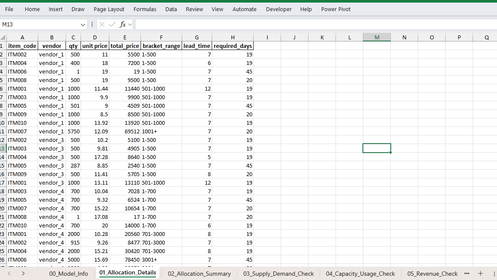
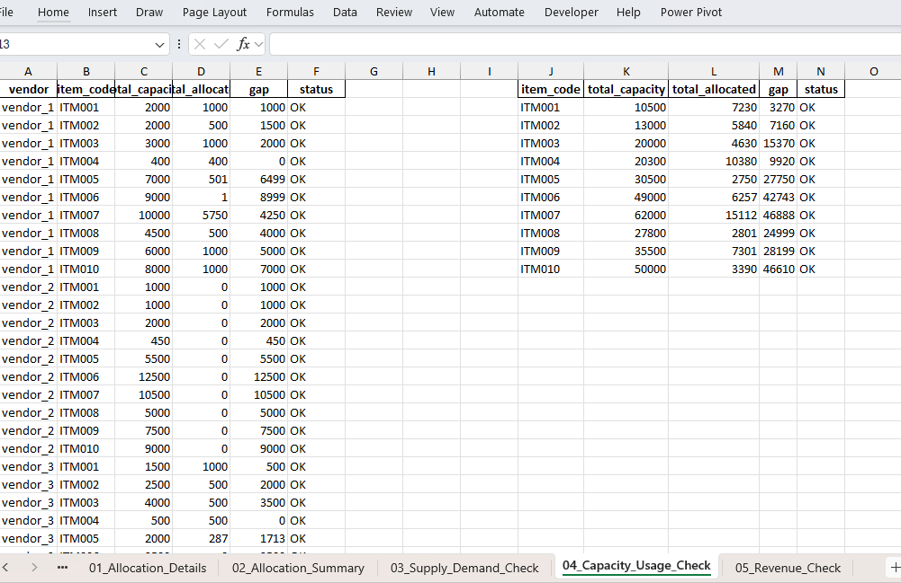
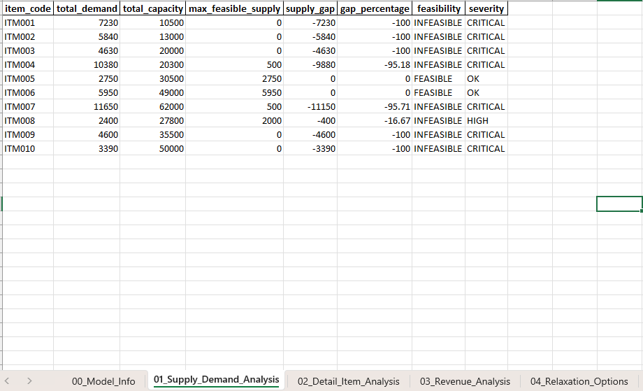
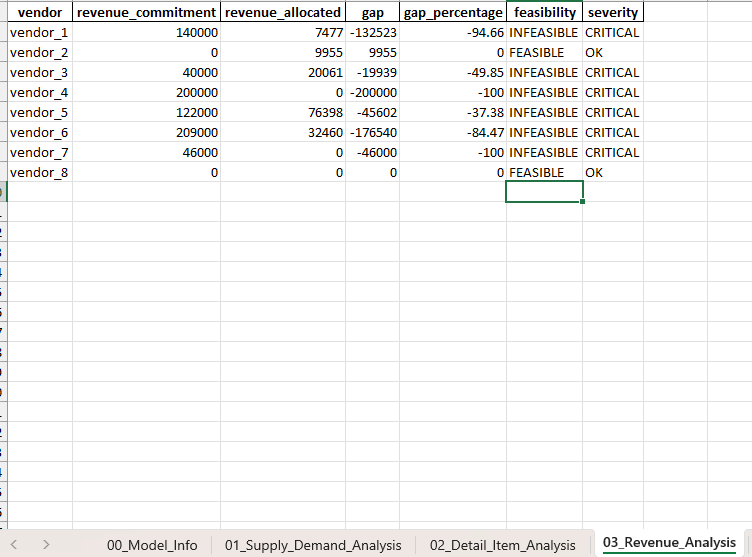
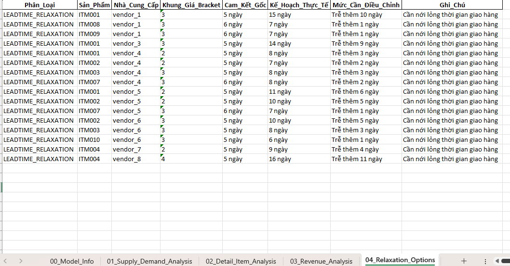

# Vendor Material Quantity Allocation Optimization

This project develops a MILP-based procurement optimization model to allocate material quantities across supplier brackets.

## Problem Statement

This project solves a vendor procurement optimization problem for multi-material sourcing.

- **Description:** 
    - A buyer must purchase multiple material items from a set of suppliers.
    - Each supplier offers each material in bracketed quantities with different unit prices, capacities, and lead-time options.
    - The buyer must satisfy all material demand while minimizing total purchase cost.

- **Main objective:** Minimize the total material purchase cost
    - Cost = purchased material quantity × unit price across all suppliers, materials, and price brackets
- **Key constraints to consider**
    1. Material demand: Total purchased quantity must satisfy material demand to ensure production
    2. Supplier capacity: Total purchases from each vendor must not exceed its supply capacity
    3. Revenue commitment: Total revenue for each supplier must meet its minimum commitment
    4. Single price bracket selection: Choose exactly one price bracket for each material from each supplier
    5. Purchase quantity range: Purchased quantity must fall within the selected bracket's minimum and maximum limits

## Input , WorkFlow and Output

### Input
- `production.xlsx`, include 3 sheets
    - demand
    - bom
    - delivery
- `vendor files`, include 4 sheets
    - price
    - capacity
    - leadtime
    - revenue

### Workflow

- Step 1: Get Source Data
    - collect data from "production.xlsx" and "vendor" folder
    - extract useful info from sheet like: demand, BOM, delivery, ....
- Step 2: Preprocessing Data
    - Convert demand from FNG into Material (BOM)
    - Define Required Delivery Date
- Step 3: Build an Optimization Model and
- Step 4: Solve and Export results to Excel file
    - If FEASIBLE, generate a list (vendor-item) quantity
    - If INFEASIBLE, analyze why and help fine-adjustment

### Output

#### WHEN FEASIBLE

- quantity buying list

- report of constraints
    - example: total capacity usage of each material
    

#### WHHEN INFEASIBLE

1. analyze which material cause infeasible
    
2. analyze which vendor cause infeasible
    
3. offer adjustment suggestions
    

## Model

### Sets and Indices
- I : set of materials $I = \{ITM001, ITM002, ITM003, \dots\}$
- J : set of suppliers $J = \{vendor_1, vendor_2, vendor_3, \dots\}$
- K : set of brackets $K = \{1, 2, 3, \dots\}$

### Parameters
- $d_{i}$: demand of material i
- $c_{i,j}$: capacity of material i at supplier j
- $l_{i,j,k}$: leadtime of material i at supplier j for bracket k
- $p_{i,j,k}$: unit price of material i at supplier j for bracket k
- $r_{j}$: minimum revenue commitment of supplier j
- $md_{j}$: minimum days required before delivery for material i
- $mdBin_{j}$ : whether supply leadtime lower than min required days of material i at supplier j for bracket k (1= yes, 0 = no)
- $qmin_{i,j,k}$ , $qmax_{i,j,k}$ : lower and upper quantity bounds of material i at supplier j for bracket k

### Decision Variables

- $x_{ijk}$ : quantity of material j in bracket k  to be allocated to supplier j, $x_{ijk} \in N$
- $y_{ijk}$ is the decision whether to allocate material i in bracket k to supplier j or not, $y_{ijk} = \{0, 1\}$

### Objective

- Minimizing the total purchase cost: $\min \sum_{i=1}^{I} \sum_{j=1}^{J} \sum_{k=1}^{K} x_{ijk} * y_{ijk}$

### Constraints

#### 1. Demand Fulfillment
Ensure demand for each material is satisfied:
$\sum_{i=1}^{I} x_{ijk} \geq d_{ij}, \forall j \in J, \forall k \in K$

#### 2. Supplier Capacity
Respect supplier capacity for each material:
$\sum_{i=1}^{I} x_{ijk} \leq c_{ij}, \forall j \in J, \forall k \in K$

#### 3. Revenue Commitment
Ensure each supplier meets its minimum revenue commitment:

$\sum_{i=1}^{I} \sum_{k=1}^{K} x_{ijk} * y_{ijk} \geq r_{j}, \forall j \in J,$

#### 4. Lead Time Feasibility
Ensure each allocation decision respect the min required date of each material

$ y_{ijk} \leq mdBin_{i}, \forall i \in I,\forall j \in J,\forall k \in K ,$

#### 5. Bracket Quantity Bounds
Ensure purchased quantities lie within each bracket’s minimum and maximum limits.

$ x_{ijk} \geq qmin_{i,j,k}, \forall i \in I,\forall j \in J,\forall k \in K ,$

$ x_{ijk} \leq qmax_{i,j,k}, \forall i \in I,\forall j \in J,\forall k \in K ,$

#### 6. Single Bracket Selection
Allow at most one bracket selection per material-supplier pair:
$\sum_{k=1}^{I} y_{ijk} \leq 1, \forall i \in I, \forall j \in J$

## Acknowledgements

This project was inspired by the work of [ERX Viet Nam](https://www.youtube.com/@ERXVietNam).

- Video: [Pricing level & planning - localization optimal solution](https://www.youtube.com/watch?v=mbrm_1KmZCU)
